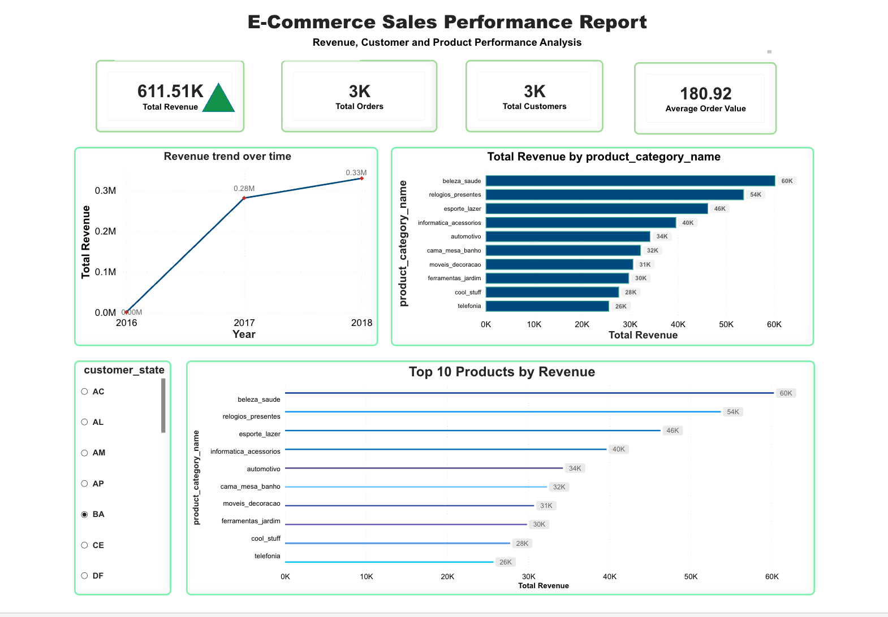
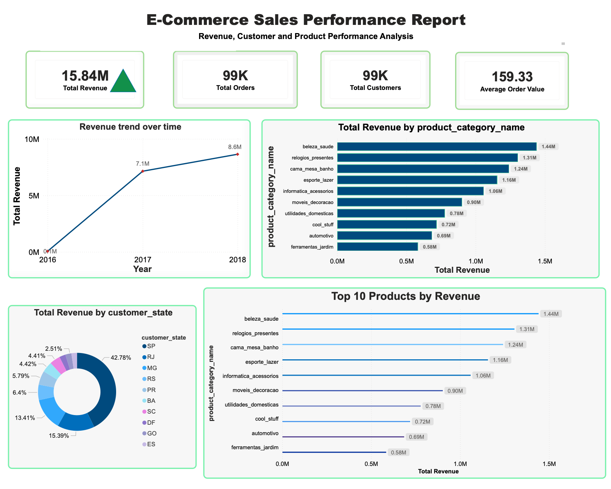

# 📊 E-Commerce Sales Performance Dashboard (Power BI)

## Project Overview

This project presents an interactive **Power BI dashboard** analyzing an e-commerce dataset to understand revenue trends, product performance, and customer distribution.

The dashboard transforms raw transactional data into meaningful **business insights using data visualization and DAX metrics**.

---

# 📷 Dashboard Preview

## Report 1 – Sales Overview

### Key Metrics

- Total Revenue: $611.51K  
- Total Orders: 3K  
- Total Customers: 3K  
- Average Order Value: $180.92  

### Insights

- Revenue shows growth from **2016 to 2018**
- **Beauty & Health** is the highest performing product category
- Product categories like **Watches & Gifts** and **Sports & Leisure** generate strong revenue
- Dashboard allows filtering by **customer state**

---

## Report 2 – Expanded Sales Analysis

### Key Metrics

- Total Revenue: $15.84M  
- Total Orders: 99K  
- Total Customers: 99K  
- Average Order Value: $159.33  

### Insights

- Revenue increased significantly from **2016 to 2018**
- **Beauty & Health generated the highest revenue**
- Revenue distribution shows strong geographic concentration
- High number of orders indicates strong customer engagement

---

# 🛠 Tools & Technologies

- Power BI
- DAX (Data Analysis Expressions)
- Data Modeling
- Data Visualization
- Business Intelligence

---

# 📂 Project Structure

Ecommerce-Sales-Dashboard  
│  
├── Report1.png  
├── Report2.png  
└── README.md  

---

# 🎯 Skills Demonstrated

- Data visualization
- Dashboard design
- Business analytics
- KPI development
- Data modeling
- Exploratory data analysis

---

# 👩‍💻 Author

Sulagna Dhal  
Computer Science Graduate Student – Data Analytics  
Arizona State University
